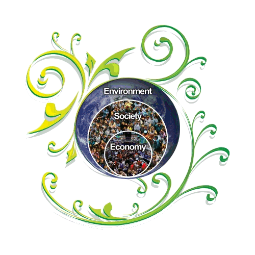
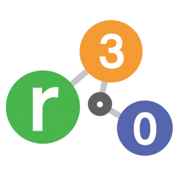

# Welcome Thrive Develpoment Platform

_Drucker 1973_ :
> _"If you can't measure it, you can't manage it"_

_However,_ more importantly are we measuring **what matters most!**

There is no doubt that _business sustainability_ is at the forefront of successful enterprises if indeed they are to succeed for many generations to come. As they move from mandatory statutory disclosure to voluntary exposure, The **_Holistic Regenerative Innovative Value Enterprise_** (THRIVE) framework offers the transformative trigger helping Enterprise ensure their future longevity.

THRIVE platform and associated Sustainability Performance Scorecard and Ciambella visualizations are **designed to provoke transformative change** by

* Encouraging enterprises to **_do good to do well_** in pursuing a competitive advantage
* Providing business analysts with **_tools to guide_** enterprise strategies
* Assisting researchers to **_analyze trends_** and effectiveness of business models for sustainability
* Allowing governments to **_forecast_** the effects of regulatory or legislative actions
* Empowering individuals to actively **_stimulate competition_** among enterprises

THRIVE platform is designed for:
> "_Greater global shared value creation and collaborative peaceful partnerships for people, planet, profit with purpose and prosperity._"

 <i> by Kolk et al 2017 </i>

