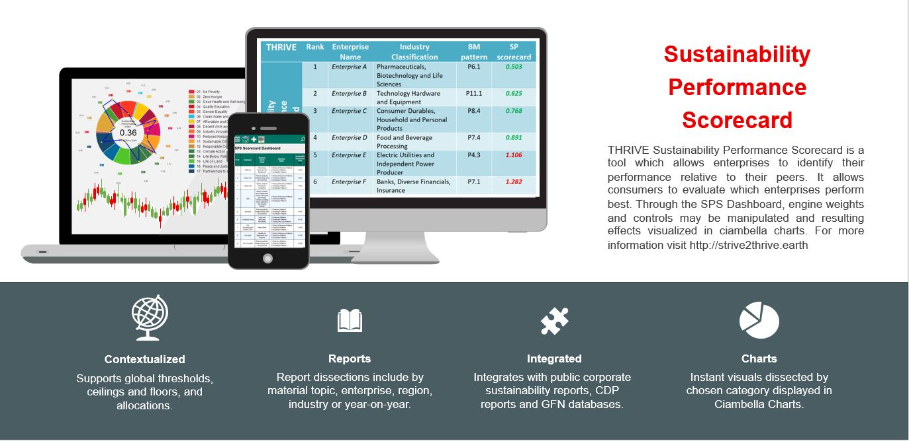

_Drucker 1973_ :
> _"If you can't measure it, you can't manage it"_

_However,_ more importantly are we measuring **what matters most!**

There is no doubt that _sustainability_ is at the forefront of successful enterprises, governments and countries, if indeed they are to succeed for many generations to come. As they move from mandatory statutory disclosure to voluntary exposure, The **_Holistic Regenerative Innovative Value Entity_** (THRIVE) framework offers the transformative trigger helping entities ensure their future longevity.

---

<i class="content-head">WHY</i>

Enterprises transitioning towards strong sustainability require ways to assess their performance, in context, relative to past performance, industry peers, within their community, and region. The service is the “holy-grail”of business strategy,linking sustainable performance to organizational business model acting on a finite planet.

<i class="content-head">HOW</i>

Theo nlineweb-based, multi-capital, values-based, and science-based tool, uses public integrated sustainability reporting data for material topic identification. A modular, user customizable, agnostic formula engine,aggregates impact measures based on global thresholds and allocations into a composite sustainability performance index.

<i class="content-head">WHAT</i>

Based on six years of trans-disciplinary research and design, the system gauges enterprise success through scale-linking at each level of impact. The system helps address wicked problems in transitioning to the circular economy by implementing back-casting targets whilst formulating their regenerative trajectory towards thrivable transformations.

---

THRIVE platform and associated Sustainability Performance Scorecard and Ciambella visualizations are **designed to provoke transformative change** by

* Encouraging enterprises to **_do good to do well_** in pursuing a competitive advantage
* Providing business analysts with **_tools to guide_** enterprise strategies
* Assisting researchers to **_analyze trends_** and effectiveness of business models for sustainability
* Allowing governments to **_forecast_** the effects of regulatory or legislative actions
* Empowering individuals to actively **_stimulate competition_** among enterprises

THRIVE platform is designed for:
> "_Greater global shared value creation and collaborative peaceful partnerships for people, planet, profit with purpose and prosperity._"

 

